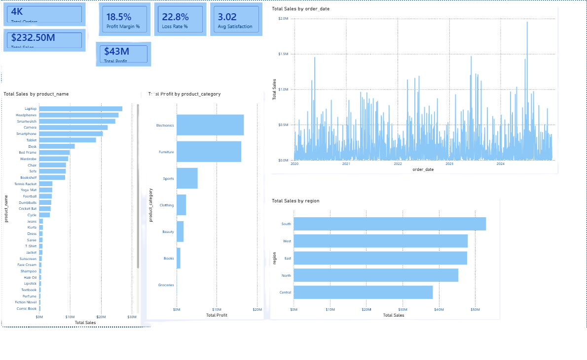
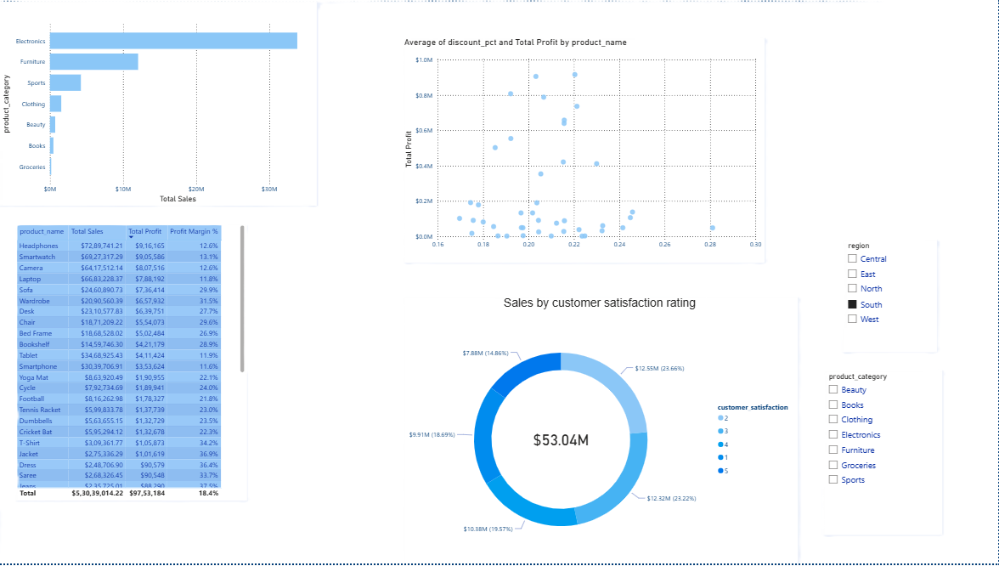
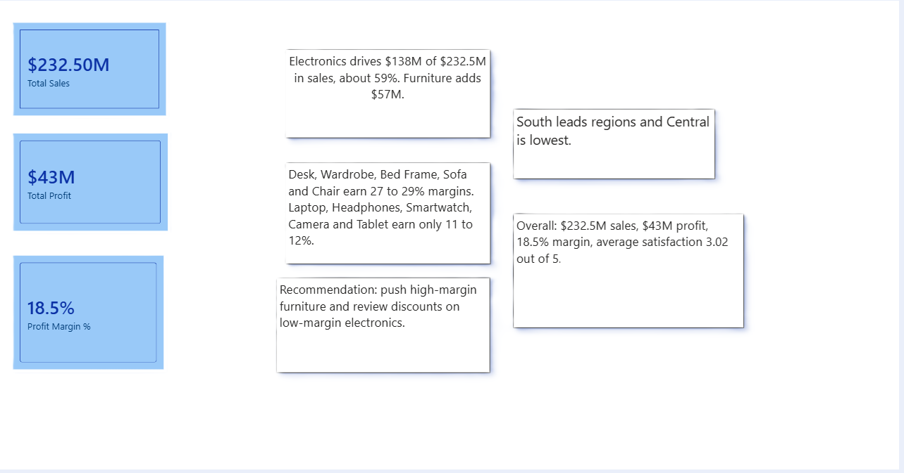

# Retail Shop Sales Dashboard

A Power BI report and SQL analysis of retail sales, profit, regions and customer satisfaction (2020 to 2024).

## Tools Used
- Power BI Desktop
- SQL (MySQL Workbench)

## Key Insights
- Electronics drives $138M of $232.5M sales (about 59%).
- South is the top region, Central is the lowest.
- Furniture earns 27 to 29% margins, while electronics earn only 11 to 12%.
- Average customer satisfaction is 3.02 out of 5.

## Recommendations
- Promote high-margin furniture.
- Review discounts on low-margin electronics.
- Improve service quality.

## Screenshots

## SQL Queries
See MYSQL.sql for the queries used in the analysis.

## Files
- report retail shop sales.pbix: the Power BI report
- MYSQL.sql: SQL queries

## Author
Sadaf, BBA (Business Analytics), Integral University
